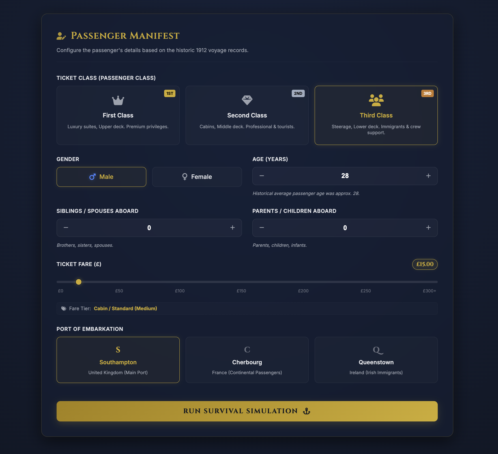
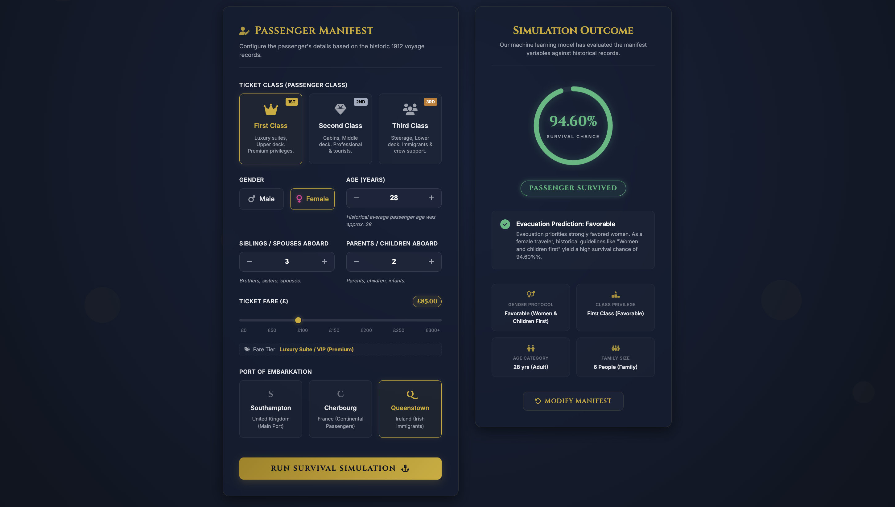

# 🚢 ETL-Powered Survival Intelligence

> An End-to-End Data Engineering & AI/ML Project for Survival Prediction using ETL Pipelines, Feature Engineering, and Machine Learning.

---

## 📌 Project Overview

**ETL-Powered Survival Intelligence** is an industry-level Machine Learning project that predicts passenger survival probability using historical voyage records.  

The project follows a complete **Data Engineering + AI workflow**, including:

✅ Data Extraction  
✅ Data Transformation  
✅ Data Loading (ETL)  
✅ Data Cleaning & Feature Engineering  
✅ Model Training & Evaluation  
✅ Cross Validation  
✅ Interactive Prediction Interface  

---

# ✨ Project Preview

## 🧾 Passenger Manifest Interface



---

## 📊 AI Prediction Dashboard



---

# 🚀 Features

- ⚙️ End-to-End ETL Pipeline
- 📊 Data Preprocessing & Cleaning
- 🧠 Machine Learning Survival Prediction
- 📈 Model Comparison & Evaluation
- 🔍 Cross Validation & Accuracy Testing
- 🎨 Interactive Frontend UI
- ⚡ FastAPI Backend Integration
- 📦 Industry-Level Project Structure

---

# 🛠️ Tech Stack

## 💻 Programming & Backend
- Python
- FastAPI

## 📊 Data Engineering & ML
- Pandas
- NumPy
- Scikit-learn

## 🎨 Frontend
- HTML
- CSS
- JavaScript

## 📈 Visualization
- Matplotlib
- Seaborn

---

# 📂 Project Structure

```bash
ETL-Powered-Survival-Intelligence/
│
├── static/
│   ├── index.html
│   ├── style.css
│   └── app.js
│
├── main.py
├── Titanic_survival_2.ipynb
├── titanic.csv
├── titanic_survival_model.pkl
├── requirements.txt
└── README.md
```

---

# ⚙️ Installation

## 1️⃣ Clone Repository

```bash
git clone https://github.com/sachinmali12/ETL-Powered-Survival-Intelligence.git
```

---

## 2️⃣ Navigate to Project

```bash
cd ETL-Powered-Survival-Intelligence
```

---

## 3️⃣ Create Virtual Environment

```bash
python -m venv venv
```

### ▶️ Activate Environment

#### Mac/Linux
```bash
source venv/bin/activate
```

#### Windows
```bash
venv\Scripts\activate
```

---

## 4️⃣ Install Dependencies

```bash
pip install -r requirements.txt
```

---

# ▶️ Run Project

```bash
uvicorn main:app --reload
```

---

# 🌐 Open in Browser

```bash
http://127.0.0.1:8000
```

---

# 📊 Machine Learning Workflow

```text
Raw Data
   ↓
ETL Pipeline
   ↓
Data Cleaning
   ↓
Feature Engineering
   ↓
Model Training
   ↓
Model Evaluation
   ↓
Prediction API
   ↓
Interactive UI
```

---

# 🧠 ML Concepts Used

- Regression & Classification
- Feature Engineering
- Cross Validation
- Model Evaluation
- Data Preprocessing
- Probability Prediction

---

# 📈 Future Improvements

- 🔥 Docker Deployment
- ☁️ Cloud Deployment
- 📊 Power BI Dashboard
- 🤖 Deep Learning Integration
- 📱 Fully Responsive Mobile UI

---

# 👨‍💻 Author

## Sachin Mali

- 💼 Data Engineering & AI/ML Enthusiast
- 🚀 Passionate about building industry-level AI systems

---

# ⭐ Support

If you like this project:

⭐ Star the repository  
🍴 Fork the project  
📢 Share with others

---

# 📜 License

This project is licensed under the MIT License.
